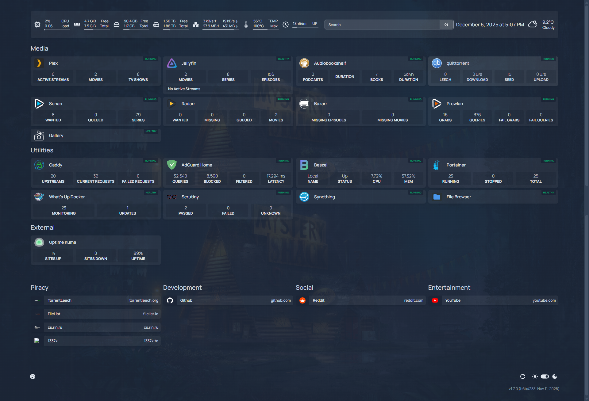

## Media stack

- Plex [:32400]
- qBittorrent [:8080] - download [vuetorrent](https://github.com/VueTorrent/VueTorrent) and place in this folder if you want to use it as an alternative UI
- Flaresolverr [:8191]
- Jackett [:9117]
- Sonarr [:8989]
- Radarr [:7878]

## Utilities stack

- [NGINX Proxy Manager](./img/pm.png) [:80, :443, :81]
- Portainer [:9443]
- Homepage [:3000] - further setup required. Rename the `example_services.yaml` file from within the homepage folder to `services.yaml` and fill in the API keys and modify domain URL as you see fit
- File Browser [:8112]
- Docker Proxy [:2375]
