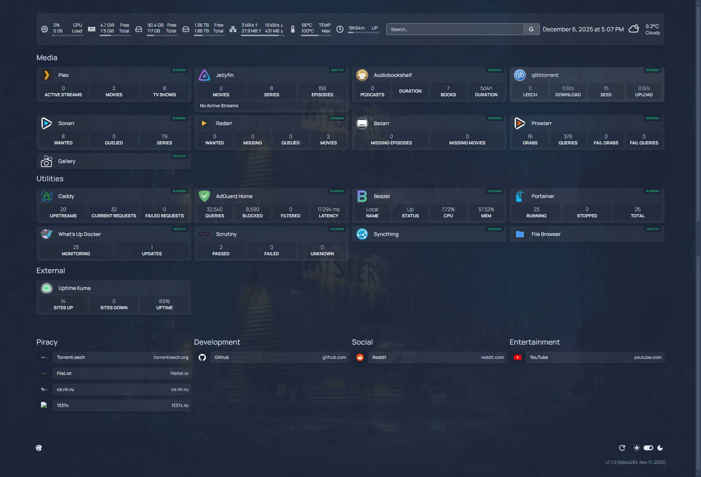

### Manual action required before firing up the services

- Modyfying the compose files themselves to point at your desired directories, user id, disabling unneeded services etc
- Modifying `caddy/Caddyfile` and `homepage/services.yaml` to point to your desired domain(s) and to disable unused services
- Creating your Authelia `configuration.yml` inside the `/mnt/HDD/DockerData/authelia` folder (or whatever you modified it to; see [docs](https://www.authelia.com/integration/prologue/get-started/)) - This can be disabled by removing forward_auth from caddy
- Creating three `.env` files inside the `env` folder:
  - `homepage.env`:
    - `HOMEPAGE_VAR_JELLYFIN`: API key for Jellyfin (Found under Administration Dashboard -> Advanced -> API Keys)
    - `HOMEPAGE_VAR_AUDIOBOOKSHELF`: API key for Audiobookshelf (Found under Settings -> API Keys)
    - `HOMEPAGE_VAR_SONARR`: API key for Sonarr (Found under Settings -> General -> Security -> API Key)
    - `HOMEPAGE_VAR_RADARR`: API key for Radarr (Found under Settings -> General -> Security -> API Key)
    - `HOMEPAGE_VAR_BAZARR`: API key for Bazarr (Found under Settings -> General -> Security -> API Key)
    - `HOMEPAGE_VAR_PROWLARR`: API key for Prowlarr (Found under Settings -> General -> Security -> API Key)
    - `HOMEPAGE_VAR_BESZEL_PASS`: Configured password when first setting up Beszel through the Web UI
    - `HOMEPAGE_VAR_PORTAINER`: Acess token for Portainer (Found under Account Settings -> Access tokens)
  - `sharex-server.env`:
    - `PASSWORD`: The password that will be used to secure file uploads to ShareX-Server
  - `vaultwarden.env` (optional): Follow the [SMTP Configuration](https://github.com/dani-garcia/vaultwarden/wiki/SMTP-Configuration) and [Enabling Mobile Client push notification](https://github.com/dani-garcia/vaultwarden/wiki/Enabling-Mobile-Client-push-notification) guides

### Start all script (`./start_all.sh`)

I ship a simple script that creates a Docker network with the "home" name (all compose files rely on it) and then starts the `media_compose.yml` and `utilities_compose.yml` stacks.

## Services running via the Docker Compose files and the ports they're each assigned on the host machine

### Media stack

- qBittorrent - download [vuetorrent](https://github.com/VueTorrent/VueTorrent) and place in this folder if you want to use it as an alternative UI
- Sonarr
- Radarr
- Prowlarr
- Navidrome
- Audiobookshelf
- PiGallery2

### Utilities stack

- Caddy
- Portainer
- Homepage
- AdGuard Home
- File Browser
- Docker Proxy
- Beszel
- Vaultwarden
- Syncthing
- Scrutiny
- OpenSpeedTest
- What's Up Docker
- ShareX Server
- Backrest
- Authelia

> Note: Caddy also reverse proxies Cockpit, so make sure to install it and [allow reverse proxying](https://garrett.github.io/cockpit-project.github.io/external/wiki/Proxying-Cockpit-over-NGINX) for it to function properly
