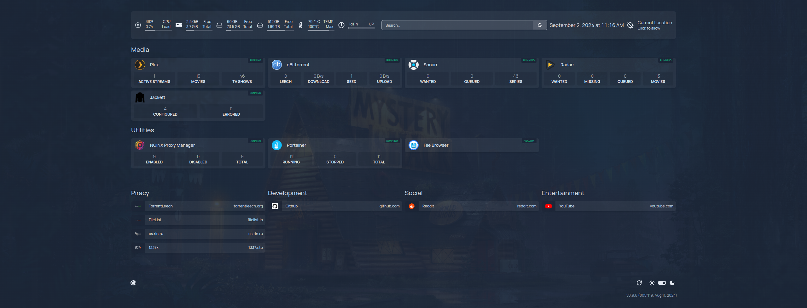

## Media stack

- Plex [:32400]
- qBittorrent [:8080] - download [vuetorrent](https://github.com/VueTorrent/VueTorrent) and place in this folder if you want to use it as an alternative UI
- Sonarr [:8989]
- Radarr [:7878]
- Prowlarr [:9696]
- Navidrome [:4553]
- Audiobookshelf [:13378]
- PiGallery2 [:8087]

## Utilities stack

- Caddy [:80, :443] - further setup required. Rename the `Caddyfile.example` file from within the caddy folder to `Caddyfile` and edit it to your needs.
- Portainer [:9443]
- Homepage [:3000 - only accessible through Docker networks, since I'm also running AdGuard Home on Windows] - further setup required. Rename the `example_services.yaml` file from within the homepage folder to `services.yaml` and fill in the API keys and modify domain URL as you see fit
- AdGuard Home [:3000, 81] - external, running on Windows
- File Browser [:8112]
- Docker Proxy [:2375]
- Beszel [:8090]
- Vaultwarden [:8088]
- Syncthing [:8384]
